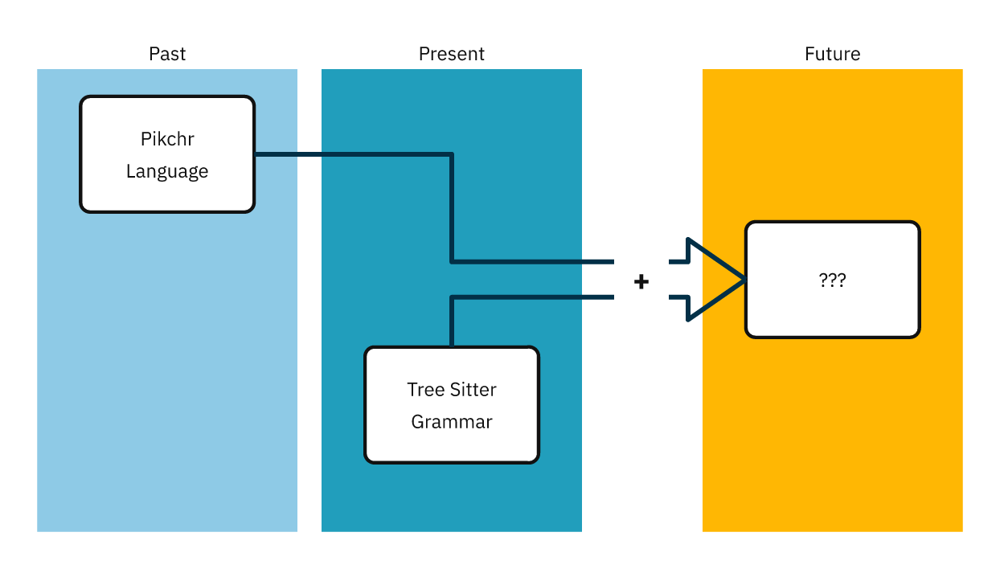

# tree-sitter-pikchr


## About

This repository contains [Tree Sitter](https://tree-sitter.github.io/tree-sitter/) grammar for [Pikchr](https://pikchr.org/) and (possibly) minor extension.

It's naïve implementation based on the [language spec](https://pikchr.org/home/doc/trunk/doc/grammar.md), with some minor precedence guesses.


## About Pikchr

More can be read at Pikchr's website, but in the nutshell it's diagramming language:

```pikchr
# Basic definitions
color=0x111111
fill=white

# Color palette
define $C1 { 0x8ecae6 }
define $C2 { 0x219ebc }
define $C3 { 0x023047 }
define $C4 { 0xffb703 }
define $C5 { 0xfb8500 }
define $text { text }
define $white { 0xdfdfdf }
define $box { box rad 3pt }
define $area { [
  box width 150% height 400% color None $2;
  text $1 above at last box.n
];}

# Position helper
define $yPos { $1<$2.nw,$2.sw> }

# Areas
PAST: $area("Past", fill $C1 ); move 10px;
PRESENT: $area("Present", fill $C2 );
BLANK: move 50px
FUTURE: $area("Future", fill $C4)

# Boxes
PL: $box() "Pikchr" "Language" at (PAST.c,$yPos(1/4,PAST))
TSG: $box() "Tree Sitter" "Grammar" at (PRESENT.c,$yPos(3/4,PRESENT))
PLUS: $text() "+" big big bold bold at BLANK.c
QM: $box "???" at FUTURE.c

thickness=1.5pt
linecolor=red

color=$C3
# "Arrows"
line from PL.e then right until even with PRESENT.c then down until even with $yPos(1/3,QM) then right until even with PLUS.w
line from TSG.n then up until even with $yPos(2/3,QM) then right until even with PLUS.w

# Arrowhead
line from (PLUS.e,$yPos(1/3,QM)) then right 6pt \
  then up 7pt then to QM.w
line from (PLUS.e,$yPos(2/3,QM)) then right 6pt \
  then down 7pt then to QM.w
```




## Extra features

Since macro per se isn't part of the language spec there is 1 extra `macroCall` expression definition, allowing for macro calls.


## Issues / Caveats


### Issues

-   [ ] [!] Missing corpus/tests
-   [ ] Macro technically isn't part of the language but it should be checked for partial correctness
-   [ ] Currently only downcase tokens are being recognized, ([potential solution](https://github.com/tree-sitter/tree-sitter/issues/122)) <sup><a id="fnr.1" class="footref" href="#fn.1" role="doc-backlink">1</a></sup>


### Caveats

-   Parser implementation has constraints that aren't present in language (e.g. 5 labels per object, unique attributes etc.)


## Extension

I'm missing some QOL features that aren't present in original language. As it doesn't make sense to keep 2 repositories (especially given current state). Extension will be kept on separate branch (until eventual breakoff) yet main development branch will be aligned with official specs.

Planned extension features:

-   Page break token
-   Import statement
-   Explicit diagram narrowing
-   Standard hex color codes (`#aa00ee`, etc.)
-   Config header support


# Footnotes

<sup><a id="fn.1" href="#fnr.1">1</a></sup> it has to be verified with implementation, though
